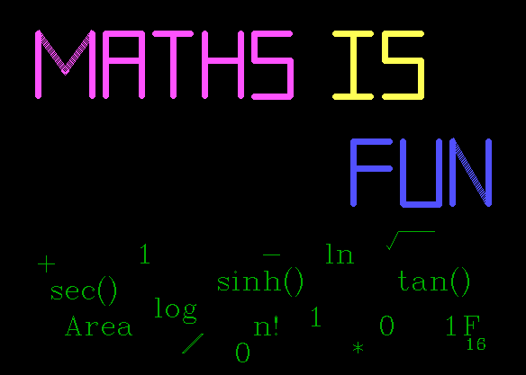
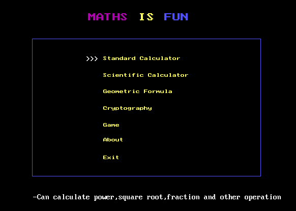

### Math Is Fun

_C++/ Computer Graphic/ Game_  
_2017_

A C++ GUI calculator app with 5 core functions: **scientific calculator, area calculator, number base converter, text encoder/decoder, and math games**.

This is the group project that I cooperated with classmates during my academic.

---

##### Installation

1. Download and Install `Turbo C++`.
1. _Copy_ the project cpp file and paste it to `C:\TurboC3\bin\`.
1. Go to `Options-> Compiler -> Code Generation`, Change _Model_ to `Huge`.
1. Go to `Options -> Linker -> Libraries`, check mark `[x]` on _Graphic Library_.
1. Go to `C:\TurboC3\bgi` , copy all files and paste it on `C:\TurboC3\bin`.
1. Compile and Run.

That's it. Have Fun with Math!.

##### Functions

| Name                  | Description                                            |
| --------------------- | ------------------------------------------------------ |
| Standard Calculator   | Calulate basic operation (add,subtract,divide,multiply) |
| Scientific Calculator | Sciencific opertion (matrix,lograrithm,trigonometry)    |
| Geometric Formula     | Find area, volume, perimeter of various shape            |
| Cryptography          | Encrypt, decrpyt sentences with key                     |
| Game                  | Fast Math, Puzzle, Fifteen Tic Tac Toe                 |
